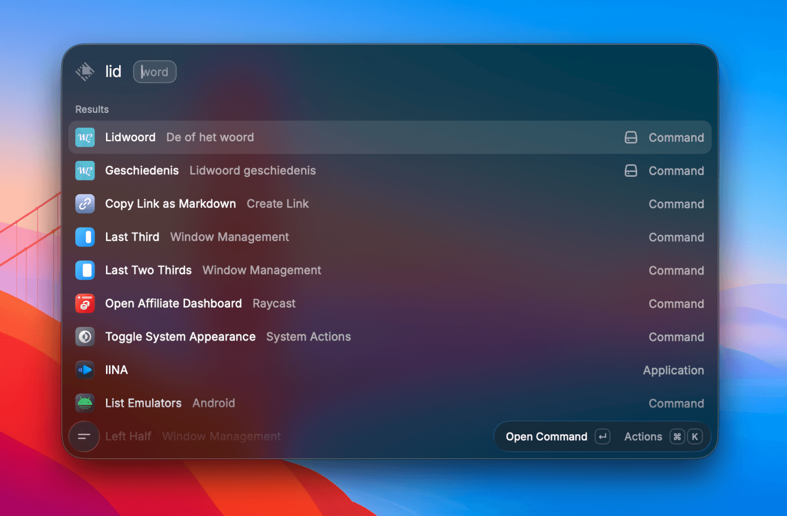
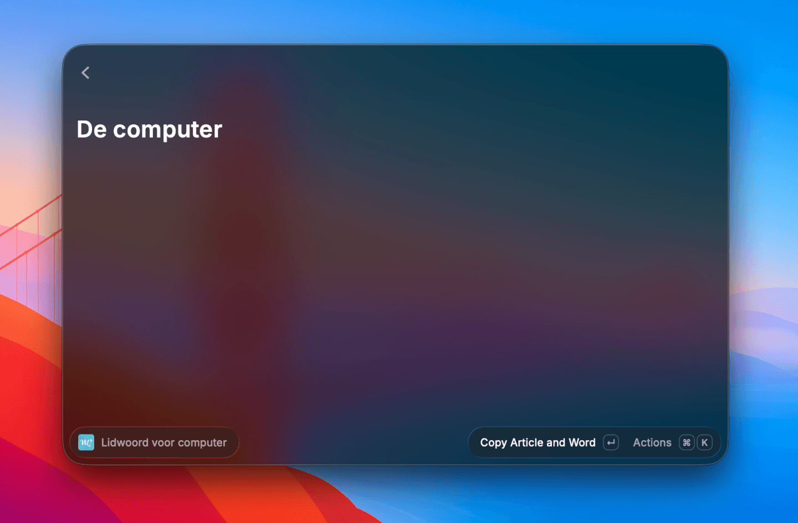
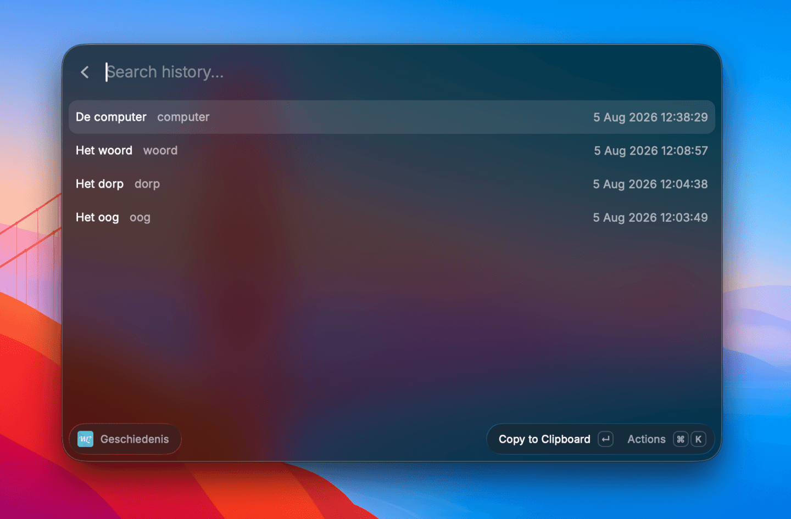

<p align="center">
  
</p>

<h1 align="center">Welk Lidwoord</h1>

<p align="center">Quickly find the correct article for a noun.</p>

<p align="center">
  
</p>

## Stack

- **Runtime:** [Bun](https://bun.sh)
- **Extension:** [Raycast](https://www.raycast.com)
- **API**: [Hono](https://hono.dev)
- **Database:** SQLite via [Drizzle ORM](https://orm.drizzle.team)

## Prerequisites

- [Bun](https://bun.sh) ≥ 1.3

## Running Locally

1. **Install dependencies**

```bash
cd api
bun install

cd raycast-extension
bun install
```

2. **Set up the database**

```bash
cd api
bun run db:migrate
```

3. **Generate API types**

```bash
cd raycast-extension
bun run generate:api
```

4. **Start the development servers**

> Make sure to import the extension in Raycast.

```bash
cd api
bun run dev

cd raycast-extension
bun run dev
```

> [!TIP]
> Visit <http://localhost:5000/docs> in your browser.

## Screenshots

| Commands                                             | Detail                                              |
| ---------------------------------------------------- | ---------------------------------------------------- |
|  |  |
| **History**                                          | |
|  | |
